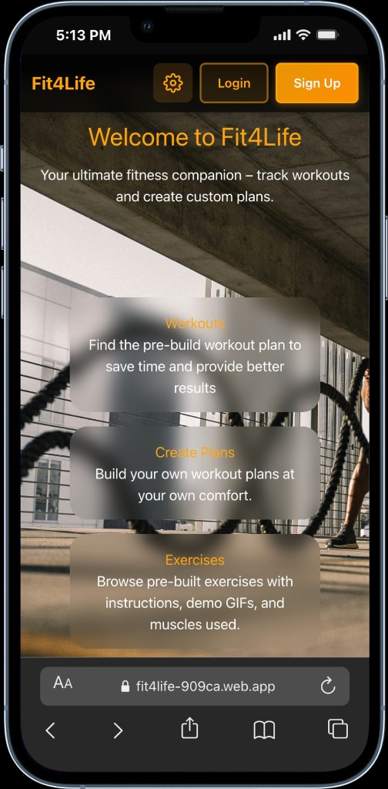
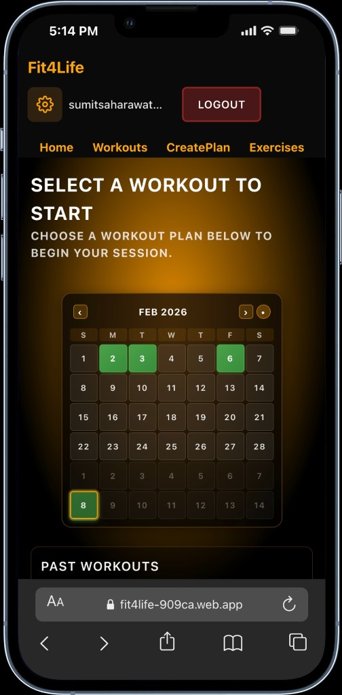
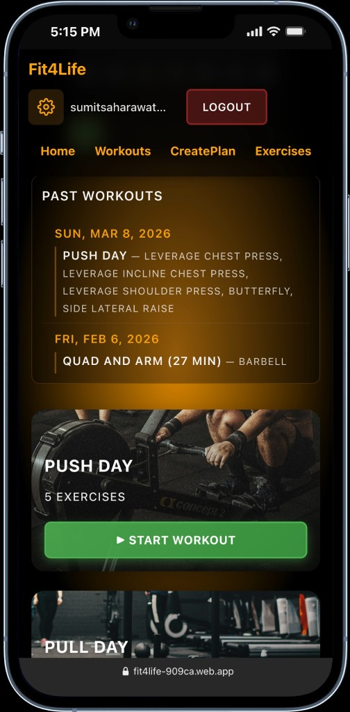
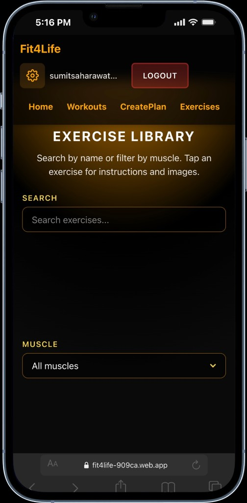
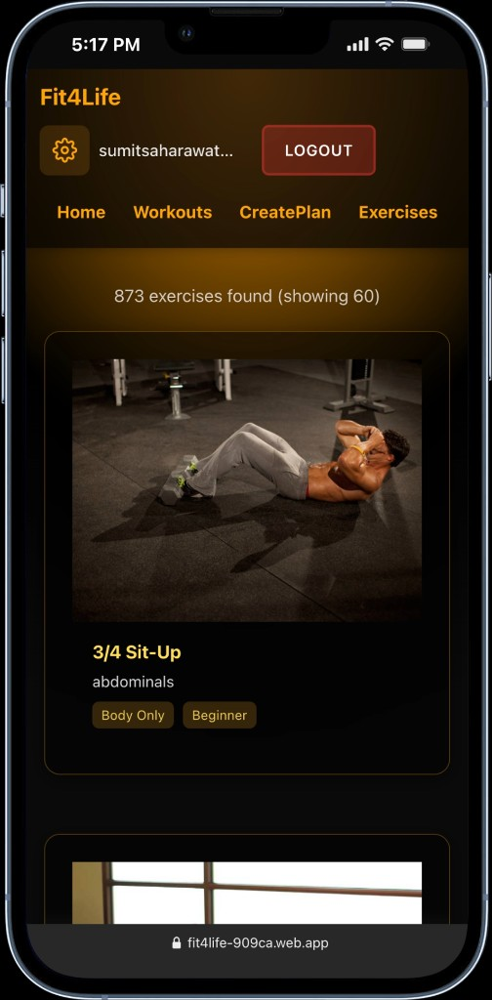
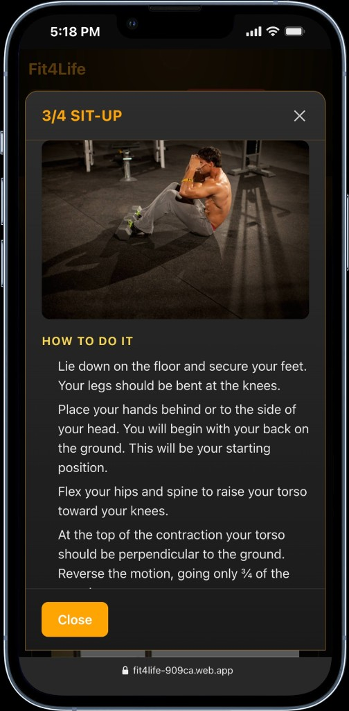
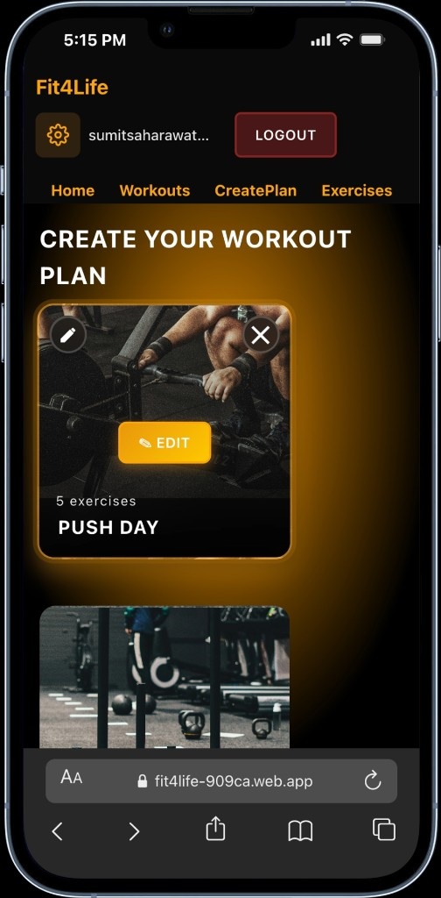
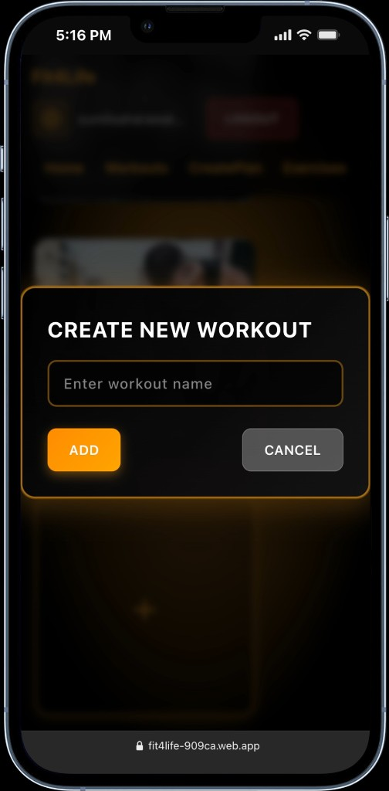

# Fit4Life

A fitness web app to create workout plans, track sessions, and view your workout history. Built with React, Vite, and Firebase.

**Live app:** [https://fit4life-909ca.web.app](https://fit4life-909ca.web.app)

---

## Screenshots

| Home Screen | Workouts (Calendar) | Workouts (Past & Start) |
|-------------|---------------------|-------------------------|
|  |  |  |

| Exercise Library | Exercise List | Exercise Detail |
|------------------|---------------|-----------------|
|  |  |  |

| Create Plan | Create New Workout |
|-------------|--------------------|
|  |  |

---

## Features

- **Create Plan** – Build custom workouts and add exercises (sets are added during the session).
- **Workouts** – Start a plan, track sets (reps, weight, complete), use an in‑workout timer, and pause/resume.
- **Past Workouts** – Scrollable history beside the calendar: date, workout name, duration, and exercises per day.
- **Calendar** – Monthly view of workout days; click a day to see details.
- **Login / Sign up** – Email and password (Firebase Auth). Workouts are stored per user in Firestore when logged in; otherwise they use `localStorage`.

---

## Tech Stack

 HTML, CSS, JavaScript, React 19, Vite 6, React Router 7, Tailwind CSS, Firebase (Firestore, Authentication, Hosting)

---

## Quick Start

### Prerequisites

- Node.js 18+
- npm

### Run locally

```bash
git clone https://github.com/SumitSaharawat/Fit4Life.git
cd Fit4Life
npm install
npm run dev
```

Open [http://localhost:3000](http://localhost:3000).

**Or** double‑click `RUN-FIT4LIFE.command` (macOS) or run `./run.sh`.  
See [HOW-TO-RUN.txt](HOW-TO-RUN.txt) for more options.

### Exercise images (optional)

Exercise cards use local images in `public/exercise-images/`. To download them from the URLs in `src/data/exercises.js`:

```bash
npm run download-exercise-images
```

If you skip this step, the app shows a placeholder image for exercises.

---

## Firebase Setup (Database & Hosting)

To use Firestore and Auth, and to deploy:

1. Create a [Firebase](https://console.firebase.google.com/) project.
2. Enable **Firestore** and **Authentication → Email/Password**.
3. Add a web app and copy `firebaseConfig` into `.env` (use [.env.example](.env.example) as a template).
4. Set your project in [.firebaserc](.firebaserc) (`projects.default`).

**Guides:**

- [DATABASE-AND-HOSTING.md](DATABASE-AND-HOSTING.md) – Firestore, Auth, and Hosting
- [FIREBASE-CONFIG-STEPS.md](FIREBASE-CONFIG-STEPS.md) – Where to paste `firebaseConfig`

Without Firebase, the app still runs using `localStorage` for workouts.

---

## Deploy

```bash
npm run build
npx firebase-tools deploy
```

Or:

```bash
npm run deploy
```

(Uses `npx firebase-tools`; you can also install `firebase-tools` globally.)

### CI/CD (GitHub Actions)

Push to `main` triggers tests, build, and deploy to Firebase Hosting. See [CI-CD-SETUP.md](docs/CI-CD-SETUP.md) for configuring `FIREBASE_TOKEN`.

---

## Project Structure

```
Fit4Life/
├── public/           # Static assets
├── src/
│   ├── contexts/     # AuthContext (Firebase Auth)
│   ├── lib/          # firebase.js, workoutsDb.js
│   ├── pages/        # Home, Login, Signup, CreatePlan, Workouts, WorkoutDetails
│   ├── Styles/
│   ├── App.jsx
│   └── main.jsx
├── firebase.json     # Hosting and Firestore config
├── firestore.rules   # Firestore security (per-user workouts)
├── vite.config.js
└── package.json
```

---

## Scripts

| Command        | Description                    |
|----------------|--------------------------------|
| `npm run dev`  | Start Vite dev server          |
| `npm run build`| Production build → `dist/`     |
| `npm run preview` | Serve `dist/` locally      |
| `npm run deploy` | Build and deploy to Firebase |


